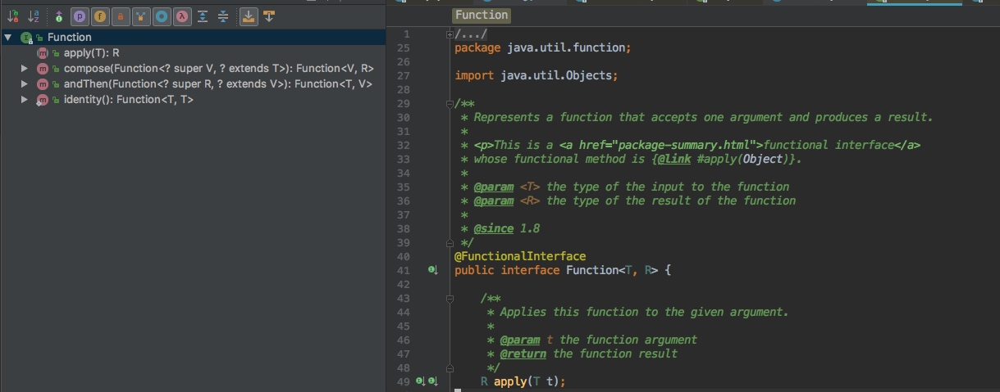

# 函数式编程
对于习惯了面向对象编程的开发者来说，抽象的概念并不陌生。面向对象编程是对数据进行抽象，而面向函数编程是对行为进行抽象。现实生活中，面向对象编程和面向函数编程都需要。
在编写回调函数和事件处理程序时，程序员不必再纠缠于匿名内部类的冗繁和可读性，函数式编程让事件处理程序变得更加简单。
在java8函数式编程中，定义了函数式编程的核心：在思考问题时，使用不可变值和函数，函数对一个值处理，生成另一个值。
## Lambda表达式
要了解Lambda表达式，首先要了解的是函数式接口。简单来说，函数式接口就是只有一个抽象方法的接口。如Function：


比如Java标准库中的java.lang.Runnable和java.util.Comparator都是典型的函数式接口。

所谓的Lambda表达式其实就是代码即行为的语句。如下列代码，创建一个线程吗，输出Lambda：

```java
new Thread(new Runnable() {
     @Override
     public void run() {
          System.out.print("lambda");     
     }
}).start();
```
这是没用Lambda表达式创建一个线程，需要重写Runnable中的run方法。实际上，我们想让线程执行无非是run方法中的代码块，但是为了达到这个目的，我们写了很多样板代码。
下面是Lambda表达式重写上述代码：

```java
new Thread(() -> {
        System.out.print("lambda");
    }).start();
```


